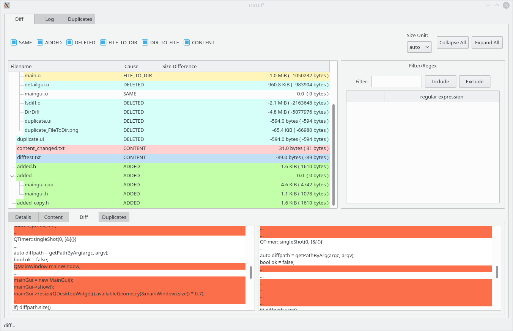

# DirDiff
This tool compares directories and show the result side by side.

## How to use it
Giving 2 directories DirDiff will recursively look for added and deleted files or folders.
At this step the content of the files is not compared. If you click "compare files" an checksum 
is calculated over all files (can be time-cosuming). After that also file differences are shown.
There are also regex filter to include or exclude specific files.

## Features
* Find duplicate files (after click "compare files")
* Integrated Diff Gui (deactivated; see TODO)

## Bugs
- [ ] Duplicates are in some cases wrong
- [ ] Select Duplicates from Duplicate don't update the diff detail view
- [ ] All Filters not work as expected; it filters more than it should
- [ ] Slow load times

## TODO
- [ ] Add more default filters
- [ ] Include more external diff tools
- [ ] Remove integrated Diff tools (for files)
- [ ] Make a summary view which shows all files recusively in a list

